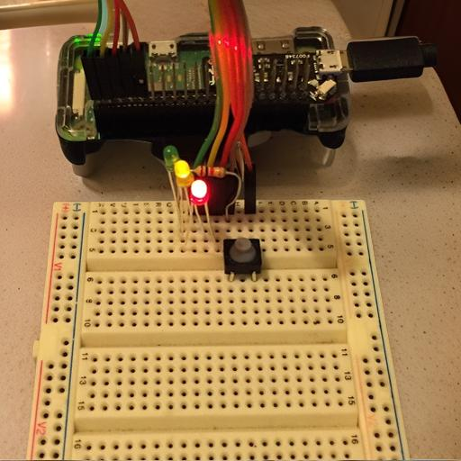

# BinCalendarRaspberryPi
Using raspberry Pi to extract recycling calendar from the Porirua City Council website to remind myself what bins to put out on the street

**Context:** Developed a bin night reminder system using a Raspberry Pi to assist with recycling and waste management based on the Porirua City Council recycling calendar.

**Actions:**

- Utilised Python with Beautiful Soup and Selenium to navigate the Porirua City Council website and extract recycling calendar information.
- Programmed the Raspberry Pi to indicate which bins to put out on the street, using colored LEDs: red for glass, yellow for recycling, and green for general rubbish.

**Outcomes:** Created an effective visual reminder system that helps ensure proper bin management, reducing the likelihood of missed pickups and promoting effective waste disposal practices.

**How it Works**

Web Scraping:

- Use BeautifulSoup to extract data from the Porirua Council Recycling website.
- Use Selenium for dynamic content if needed.

Data Processing:

- Store the extracted data (e.g., bin collection schedule) in a list or dictionary.

Sending Data to Raspberry Pi:

- If running locally, process the data directly in the same script.
- If remote, send data via:
        HTTP Requests (REST API).
        MQTT Protocol for lightweight messaging.

Controlling the LEDs:

- Use the RPi.GPIO library to set up GPIO pins for each LED (recycling, glass, rubbish).
- Implement logic to light up LEDs based on the collection schedule.

Running the Script:

- Set up a cron job on the Raspberry Pi to run the script at regular intervals (e.g., daily).
